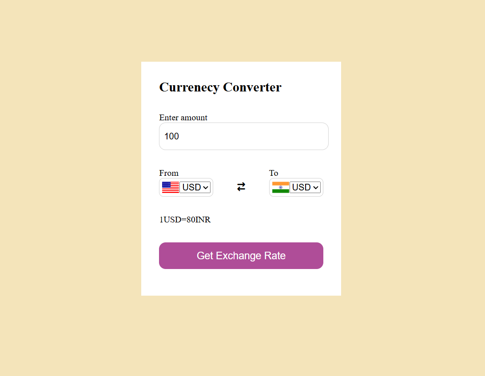

💱 Currency Converter (HTML, CSS, JavaScript)
🔍 Overview

This Currency Converter Web App is a simple yet powerful tool built using HTML, CSS, and JavaScript. It allows users to convert currencies in real-time based on the latest exchange rates. The interface is clean, responsive, and user-friendly.

✅ Features

✔ Enter Amount – Input any amount you want to convert.
✔ Select Currencies – Choose the currency to convert From and To (e.g., USD to INR).
✔ Exchange Rate Display – Shows the current conversion rate (e.g., 1 USD = 80 INR).
✔ Convert Button – Click Get Exchange Rate to calculate and display the converted amount.
✔ Country Flags – Displays respective country flags for easy identification.

🛠 Technologies Used

HTML5 – Structure of the web page

CSS3 – Styling for UI design

JavaScript (ES6) – Logic for currency conversion and interactivity

📸 Preview

📂 How It Works

Enter the amount you want to convert.

Select the source currency and target currency from the dropdowns.

Click on Get Exchange Rate to calculate the converted amount.

Displays the exchange rate and final converted value.

📌 Use Cases

Personal finance and travel currency conversion

Learning JavaScript DOM manipulation

Understanding API integration (if extended to use live exchange rates)

🚀 Future Enhancements

✅ Integrate real-time exchange rates API (e.g., ExchangeRate API)

✅ Add more currencies with search functionality

✅ Implement dark mode for better UI

✅ Make it fully responsive for mobile devices
